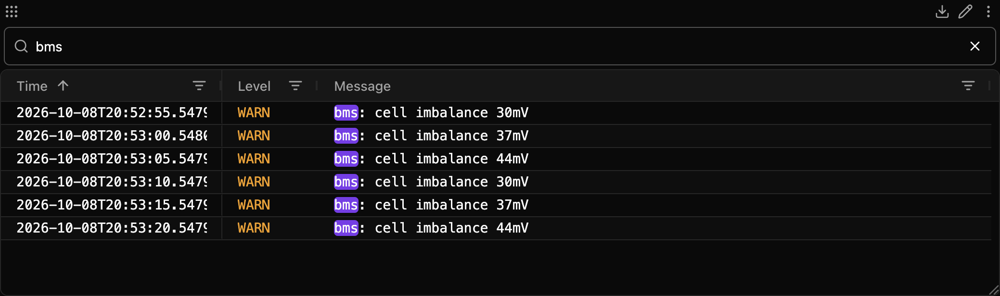
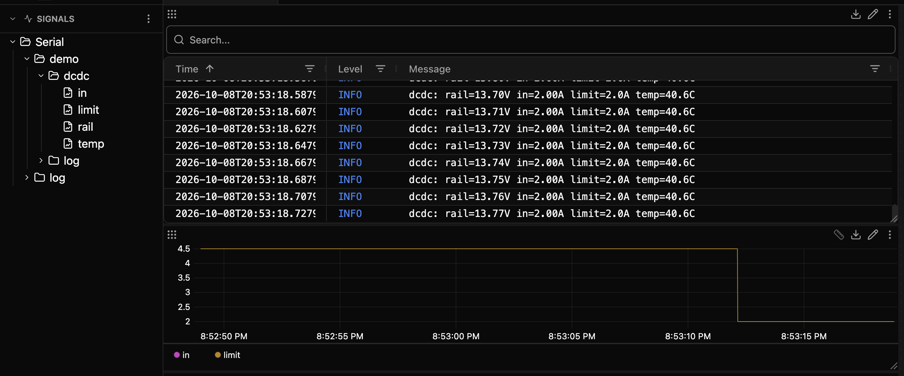

# Serial

Record what a device prints on its serial console: every line in the Log panel, every printed value a signal you can plot.

- 🔎 **The whole console, searchable**: each line keeps the device's time stamp, level and module.
- 📈 **Values without a decoder**: `rail=13.8V in=4.50A` becomes `rail` in V and `in` in A.
- 🧩 **Common formats built in**: Zephyr, ESP-IDF, Arduino on ESP32 and Linux kernel logs, plus Teleplot and the Arduino plotter.
- ⏱️ **The device's clock**: a 20 ms loop plots 20 ms apart, not when USB delivered the line.
- 💬 **Commands from the app**: send text, run a shell command and read its reply, or pulse a reset line.
- ⚡ **Room for your flasher**: release the port before a flash and take it back after, from a build hook.
- 🔌 **Any port**: USB serial, COM and tty ports, raw TCP and RFC 2217, on Linux, macOS and Windows.

[](assets/readme/hero.mp4)



## What it reads

| | |
|---|---|
| **Connections** | USB serial and other serial ports (COM, `/dev/tty*`, `usb:<vid>:<pid>:<serial>`), raw TCP, RFC 2217, and a built-in demo board |
| **Log prefixes** | Zephyr, ESP-IDF, Arduino on ESP32, the Linux kernel, and a level word such as `ERROR:` or `[WRN]` |
| **Values** | `key=value`, Teleplot, the Arduino plotter (labelled and bare), and a repeated `label: value` |
| **Runs on** | Linux, macOS and Windows, with Zelos 26.0.8 or later |

## One line, recorded

A Zephyr board prints:

```text
[00:00:12.340,000] <inf> dcdc: rail=13.73V in=4.50A limit=4.5A temp=37.2C
```

Serial records it twice, both at the board's 12.340 s:

| Event | What lands |
|---|---|
| `Serial/<port>/log` | A row at level `info`, name `dcdc`, message `dcdc: rail=13.73V in=4.50A limit=4.5A temp=37.2C` |
| `Serial/<port>/dcdc` | The signals `rail` = 13.73 V, `in` = 4.5 A, `limit` = 4.5 A and `temp` = 37.2 C |



## Quick start

1. **Configure** a port: pick a device in the **Port** list, or press **Auto-configure** to add one port for each USB serial device that no port uses yet.
2. **Start** Serial. Lines appear in the Log panel, and values appear as signals.

No hardware? Set **Connection** to **Demo board**, or press Auto-configure with no port and no device.
The demo board prints like a Zephyr board: a power converter's status every 20 ms and a battery warning every 5 s.
It answers the shell commands `dcdc limit get` and `dcdc limit set <amps>`.

Configure Serial from Zelos 26.0.8 or later: an older app cannot show its config form.


## What it records

All events go under one trace source, `Serial` by default (**Prefix** in Advanced (all ports)).
Each port has a name, set by **Name** in the config.

| Event | Holds |
|---|---|
| `Serial/<port>/log` | Every line the device printed, as it printed it, without the time stamp and level marker: those have their own columns. The level, the module (`name`), and the file and line where the format prints them. Also the text sent by Send and Run Command (name `tx`), and the extension's notes on the port (name `serial`). |
| `Serial/<port>/<module>` | The values from lines that carry a module, such as Zephyr's `dcdc` or an ESP-IDF tag. One event per module, one field per value. |
| `Serial/<port>/kernel` | The values from Linux kernel lines. |
| `Serial/<port>/values` | The values from lines without a module. |
| `Serial/log` | The extension's own log: warnings about late names, units and caps, failed opens, and unexpected errors. |

In the Log panel, the **Source** column shows the name: the module for a device line, `tx` for sent text, and `serial` for a note.

A port without a Name takes a name from its config: the **Port** field, `<host>:<tcp port>` for a network port, or `demo`.
The name is made safe for the trace: `/dev/ttyUSB0` becomes `dev_ttyUSB0`, `usb:0403:6001:A50285BI` becomes `usb_0403_6001_A50285BI`, `COM7` stays `COM7`, and `bench.local:2217` becomes `bench_local_2217`.

- Shell prompts and the device's echo of sent commands are not logged.
- The last line a device printed before it crashed is logged, as a partial line.
- A line that carries the device's uptime is placed by the device's clock.
- A module's signals appear about 2 s after its first values. A name that first appears later is not recorded: `Serial/log` gets one warning. Restart the extension to include it.

Line endings, prompts, the device clock and signal naming are in [Recording](https://github.com/zeloscloud/zelos-extension-serial/blob/main/docs/reference.md#recording).

## Recognised formats

The extension reads the log prefix first, then looks for values in the text after the module.
Any other line is a plain log line at level `info`.

### Log prefixes

| Format | Example | Logged message | Level | Module | Device time |
|---|---|---|---|---|---|
| Zephyr | `[00:00:05.000,000] <wrn> bms: cell imbalance 30mV` | `bms: cell imbalance 30mV` | warn | `bms` | yes |
| Zephyr, date | `[2026-10-07 12:00:01.122,348] <err> main: Error message example.` | `main: Error message example.` | error | `main` | no |
| Zephyr, ticks | `[0000032768] <err> main: Error message example.` | `main: Error message example.` | error | `main` | no |
| ESP-IDF | `E (588) SPIFFS: mount failed, -10025` | `SPIFFS: mount failed, -10025` | error | `SPIFFS` | yes, from the default millisecond stamp |
| Arduino on ESP32 | `[  1065][E][sd_diskio.cpp:807] sdcard_mount(): f_mount failed` | `[sd_diskio.cpp:807] sdcard_mount(): f_mount failed` | error | `sd_diskio`, with file and line | yes |
| Linux kernel | `[    1.234567] usb 1-1: new device` | `usb 1-1: new device` | info | `kernel` | yes |
| A level word | `ERROR: invalid argument` | `invalid argument` | error | none | no |

### Values

The first habit that matches the text after the module wins.

| Habit | Example | Signals |
|---|---|---|
| Teleplot | `>myValue:1234§km²` | `myValue` = 1234, unit `km²` |
| key=value | `rail=13.65V in=4.50A limit=4.5A temp=35.0C` | `rail` = 13.65 V, `in` = 4.5 A, `limit` = 4.5 A, `temp` = 35 C |
| Arduino plotter, labelled | `label_1:1,label_2:2` | `label_1` = 1, `label_2` = 2 |
| Arduino plotter, bare | `5,6` | `value1` = 5, `value2` = 6, from the third line in a row with the same number of columns |
| label: value | `Voltage: 3.29 V` | `Voltage` = 3.29 V, from the second line with the same label; the label has at most three words and no hex literal |

A number is decimal, with an optional sign and exponent: `0xFF`, `nan` and `inf` are not numbers.
A unit can follow the number, as in `13.65V`, `35%`, `km²` or `m/s2`.

The exact unit rule, other stamp variants, leading zeros, hex detection, hex dumps and the label: value rules are in [Formats](https://github.com/zeloscloud/zelos-extension-serial/blob/main/docs/reference.md#formats).

## Configuration

The config holds a list of `ports` and one `advanced` group.
Each port picks a **Connection**:

| Connection | Reads | Fields |
|---|---|---|
| `serial` (Serial port) | A COM or `/dev/tty*` port, or a device ID | **Port**, and **Baud** (default 115200) |
| `tcp` (TCP) | A raw TCP server | **Host**, **TCP port** |
| `rfc2217` (RFC 2217) | An RFC 2217 server, such as ser2net | **Host**, **TCP port**, and **Baud** (default 115200) |
| `demo` (Demo board) | The built-in demo board | nothing |

The config form shows every field, its choices and its default.
The JSON keys are in [Configuration keys](https://github.com/zeloscloud/zelos-extension-serial/blob/main/docs/reference.md#configuration-keys).
The extension checks the config when it starts.
A mistake logs one sentence that names the port and the field, then the extension exits.

### Device IDs

The **Port** list shows each serial device by product name and path, such as `FT232R USB UART (/dev/ttyUSB0)`.
When the device has a serial number, the list stores its device ID instead of the path:

```
usb:0403:6001:A50285BI
```

The ID is `usb:`, the vendor ID and product ID in lower-case hex, and the serial number.
The operating system assigns the path, such as `COM7` or `/dev/ttyUSB0`, each time the device appears, so the path can change when you replug or add a device.
The device stores its vendor ID, product ID and serial number, so the ID finds the same device on any USB port.

The first time the Port list opens after Serial is installed, the agent can take more than 10 s to start it, and the app's list gives up after 10 s.
Open the list again.
Auto-configure waits up to 30 s.

### Reconnects

When a port fails or the device is unplugged, the extension closes it and tries again; a replugged board reopens within 0.5 s, in time for its boot output.
A setting the driver refuses, such as a baud, stops the port until you change the config.

### Examples

```json
{ "ports": [{ "connection": "serial", "port": "usb:0403:6001:A50285BI", "baud": 115200, "name": "dut" }] }
```

```json
{ "ports": [{ "connection": "tcp", "host": "127.0.0.1", "tcp_port": 4001, "name": "dut" }, { "connection": "tcp", "host": "127.0.0.1", "tcp_port": 4002, "name": "linux" }] }
```

```json
{ "ports": [{ "connection": "demo" }] }
```

## Actions

Every action except List Ports and Auto-configure takes `port`, titled **Port name**: the port's **Name**, or its default name, not its path.
Leave it out to act on the first configured port.

| Action | Path | What it does | Read-only |
|---|---|---|---|
| List Ports | `Serial/list_ports` | Lists every serial port on this machine, USB or not, for the **Port** field. Works while the extension is stopped. | yes |
| Auto-configure | `Serial/auto_config` | Keeps the configured ports and adds one `serial` port for each USB serial device that no port uses yet. Opens no port. Works while the extension is stopped. | yes |
| Send | `Serial/send` | Writes `text` and the line ending. With `hex`, writes `text` as hex bytes, such as `0d0a`, and adds nothing. | no |
| Run Command | `Serial/command` | Sends `text` as a shell command and returns the lines the device prints in reply. | no |
| Reset Device | `Serial/reset` | Pulses the port's reset line for 100 ms. | no |
| Release Port | `Serial/release` | Closes the port so another program can open it. DTR and RTS stay as they are. | no |
| Acquire Port | `Serial/acquire` | Opens a released port again. | no |
| Get State | `Serial/get_state` | Returns the port's state, health, clock, counters and signals. | yes |
| Sample | `Serial/sample` | Returns the last lines the port received, or its last raw reads as hex. | yes |

Run Command's reply ends at the next prompt, after 300 ms without bytes once a reply line has arrived, or at `timeout_s` (default 2 s):

```json
{ "reply": ["limit set to 2.0 A"], "ended_by": "prompt", "duration_ms": 18 }
```

Send, Reset Device, Release Port and Acquire Port return `{"bytes_written": n}` or `{"ok": true}`.
Sample returns `{"lines": [...]}`, or `{"chunks": [...]}` with `hex`.

A failed action returns one sentence that says what to do.
Every action's rules, the Get State keys and the error list are in [Actions](https://github.com/zeloscloud/zelos-extension-serial/blob/main/docs/reference.md#actions).

## Flashing without touching the app

A flasher needs the port, and the extension holds it open.
Release the port before you flash and acquire it after:

```bash
zelos actions execute Serial/release --params '{"port": "dut"}'
idf.py -p /dev/ttyUSB0 flash
zelos actions execute Serial/acquire --params '{"port": "dut"}'
```

`dut` is the port's Name; with `--params '{}'` the actions act on the first configured port.
Acquire Port waits up to 14 s for the port to open, so a board that appears again after its flash is acquired.
It fails at once on a permission error or an unsupported setting.
After 14 s it fails with the port's health sentence, and the extension keeps trying to open the port.

### Boot output after a flash

Bytes that arrive while the port is released are lost: no program reads them.
A USB-serial bridge that stays connected while the target resets, such as an ST-LINK or the bridge on many development boards, delivers the boot output into that gap.
An Acquire Port that starts as the flasher ends can still miss all of it.

To log the boot output, acquire the port first, then reset the target.
When the port has a **Reset line**, such as an ESP32 board set up as in Board reset below, run Reset Device after the flash, here with the `flash-dut` script from Arduino CLI and idf.py below:

```bash
./flash-dut idf.py -p /dev/ttyUSB0 flash && zelos actions execute Serial/reset --params '{"port": "dut"}'
```

Otherwise, run the flasher's own reset command after Acquire Port.
An ST-LINK resets the target through its debug connection, not the serial port, so this works while the extension holds the port:

```bash
st-flash --connect-under-reset reset
```

### PlatformIO

Add a script to the environment in `platformio.ini`:

```ini
[env:esp32dev]
platform = espressif32
board = esp32dev
framework = arduino
extra_scripts = post:zelos_serial.py
```

`zelos_serial.py`, next to `platformio.ini`:

```python
import json
import subprocess

Import("env")

PARAMS = json.dumps({"port": "dut"})


def zelos(action, check=False):
    return subprocess.run(["zelos", "actions", "execute", action, "--params", PARAMS], check=check)


def release(source, target, env):
    zelos("Serial/release", check=True)


def acquire(source, target, env):
    if zelos("Serial/acquire").returncode:
        print("acquire failed; run Serial/get_state to see why")


env.AddPreAction("upload", release)
env.AddPostAction("upload", acquire)
```

When release fails, for example because the agent is not running, the upload stops before it touches the port.
PlatformIO runs the post action only when the upload succeeds; after a failed upload, run acquire by hand.

### Arduino CLI and idf.py

Save this as `flash-dut` and make it executable:

```bash
#!/usr/bin/env bash
set -euo pipefail
params='{"port": "dut"}'
zelos actions execute Serial/release --params "$params"
trap 'zelos actions execute Serial/acquire --params "$params" || echo "flash-dut: acquire failed; run Serial/get_state to see why" >&2' EXIT
"$@"
```

Put it in front of the flash command:

```bash
./flash-dut arduino-cli upload -p /dev/ttyUSB0 --fqbn esp32:esp32:esp32 .
./flash-dut idf.py -p /dev/ttyUSB0 flash
```

It acquires the port again whether the flash succeeds or fails, and exits with the flash's status.
When acquire fails, it prints a warning and still exits with the flash's status.
When release fails, it stops before flashing and exits with release's status.

## Board reset

**Reset Device** drives the **Reset line** away from its level at open for 100 ms, then back.
Set the lines to match the board's reset circuit:

| Board | DTR at open | RTS at open | Reset line |
|---|---|---|---|
| ESP32 board with an auto-reset circuit | `off` | `off` | `rts` |
| Arduino board with a DTR capacitor | `on` | `on` | `dtr` |

The demo device resets on a DTR pulse.
The tests run these recipes against simulated ports, not physical boards, so they do not show whether a Windows driver still pulses the lines at open.

On Linux and macOS, the kernel raises DTR and RTS for a moment when a port opens, whatever the settings say.
Some boards therefore reset once when the extension connects, and again on Acquire Port.
On Windows, `off` asks the driver to keep the line deasserted from the open.
Release Port and stopping the extension leave DTR and RTS as they are.
TCP and RFC 2217 ports have no reset line, and an RFC 2217 port keeps the DTR and RTS levels the server sets.

## Health

Get State returns one health sentence, and each sentence says what to do.
These sentences hide a fact worth knowing:

| Health | Also know |
|---|---|
| `Connected. No bytes yet. …` | No byte arrived in the 10 s since the port opened. An ST-LINK V3 bridge at a wrong baud delivers no bytes at all. A device that prints only when asked stays silent until you run Send or Run Command. |
| `Bytes arrive but no line ends. …` | Bytes arrived for 10 s without a line end, a prompt or a 100 ms pause. At a wrong baud the noise often holds line ends too; then it is logged as lines of noise, and this sentence does not appear. |
| `No values found in <n> lines. …` | Appears only while **Turn printed values into signals** is on, after 300 or more lines with no value. For a device that prints no values, turn that setting off. |
| `<where> is in use by another program, …` | Two ports in this config that name one device also land here: the second cannot open it. |
| `No device matches <port>. …` | The port connects when the device appears, within 0.5 s. |
| `Unsupported setting: <error>. …` | The port does not retry until you change the config. |

Every sentence is in [Health](https://github.com/zeloscloud/zelos-extension-serial/blob/main/docs/reference.md#health).

## Limits

- Binary protocols are not decoded.
- Device protocols, such as GPS NMEA sentences, are not decoded; they are logged as plain lines.
- RFC 2217 is tested with ser2net 4.3.4, 4.6.0 and 4.6.7.
- Opening an RFC 2217 port waits up to 2 s for each reply from the server. While a slow server answers, the port's actions wait too and can time out.
- There is no live console tab. The Log panel shows the lines, and Send and Run Command write to the port.
- The baud and the DTR and RTS lines cannot change while a port runs, and the extension cannot send a break.
- Lines are decoded as UTF-8; invalid bytes are replaced.
- On Linux and macOS, the extension opens a serial port exclusively. That does not keep out a program that opened the port first, which can take every byte, or one that runs as root. Windows always opens a serial port exclusively.
- A headless agent older than 26.0.9 that listens on a port other than 2300 does not tell its extensions where it is, so Serial cannot reach it. Run that agent on port 2300, or update it.
- On Windows, the agent ends the extension without a final flush, so the last batch of rows may be lost.

## Development

See [CONTRIBUTING.md](https://github.com/zeloscloud/zelos-extension-serial/blob/main/CONTRIBUTING.md) for the prerequisites, every `just` command, a local run and the RFC 2217 tests.

## Links

- **Repository**: [github.com/zeloscloud/zelos-extension-serial](https://github.com/zeloscloud/zelos-extension-serial)
- **Issues**: [github.com/zeloscloud/zelos-extension-serial/issues](https://github.com/zeloscloud/zelos-extension-serial/issues)
- **Extensions in Zelos**: [docs.zeloscloud.io/latest/app/extensions](https://docs.zeloscloud.io/latest/app/extensions/)

## License

MIT. See [LICENSE](https://github.com/zeloscloud/zelos-extension-serial/blob/main/LICENSE).
